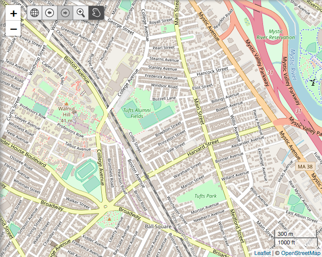

Leaflet.NavBar
==============

NOTE: this code has been modified for use in the OpenGeoportal project.
Modifications include the addition of a Zoom Box control and storing the
bounds in the history (instead of zoom and map center), since the main
application relies on bounds-based queries. In its current state,
this plugin will not work as-is outside of OGP, as it relies on a sprite
sheet that lives in the main project. Future work could see the
inclusion of the relevant sprites or replacement of sprites with font
icons, etc.
(chrissbarnett - 9.21.2018)

Simple navigation toolbar for Leaflet.

Demo: http://davidchouse.github.io/Leaflet.NavBar/



## Install via Bower
````js
bower install leaflet-navbar
````

<a name="using" />
## Using the plugin

The default state for the control is just below the zoom control. This will allow map users to navigate forward and back in the map's view history as well as navigate to a home view.

````js
var navbar = L.control.navbar().addTo(map);
````

methods:
````js
navbar.goHome();
````
Go to home. Same as clicking on the home button.

````js
navbar.goBack();
navbar.goForward();
````
Navigate through history. Will return false if no view is available
to navigate to.

````js
navbar.zoomBoxOn();
navbar.panHandOn();
````
Toggle between Zoom Box and Pan (default) controls.


Options for initialising the Leaflet.NavBar control.

| Option | Type | Default | Description
| --- | --- | --- | ---
| position | String | `'topleft'` | The initial position of the control.
| center | `L.LatLng` | Map's Current Position | The center point for the home view.
| zoom | Number | `0` | The zoom value for the home view.
| useBounds | Boolean |  false | store bounds in the history, instead of zoom/center
| bounds | `L.LatLngBounds` | Map's full extent | if useBounds, then this is the home view
| addZoomBox | Boolean | false | add zoombox/panhand controls
| forwardTitle | String | 'Go forward in map view history' | title text for the history next button
| backTitle | String | 'Go back in map view history' | title text for the history back button
| homeTitle | String | 'Go to home map view' | title text for the map home button 'Go to home map view',
| zoomBoxTitle | String | 'Draw a box to zoom' | title text for Zoom Box button
| panHandTitle | String | 'Drag to pan' | title text for Pan Hand button
